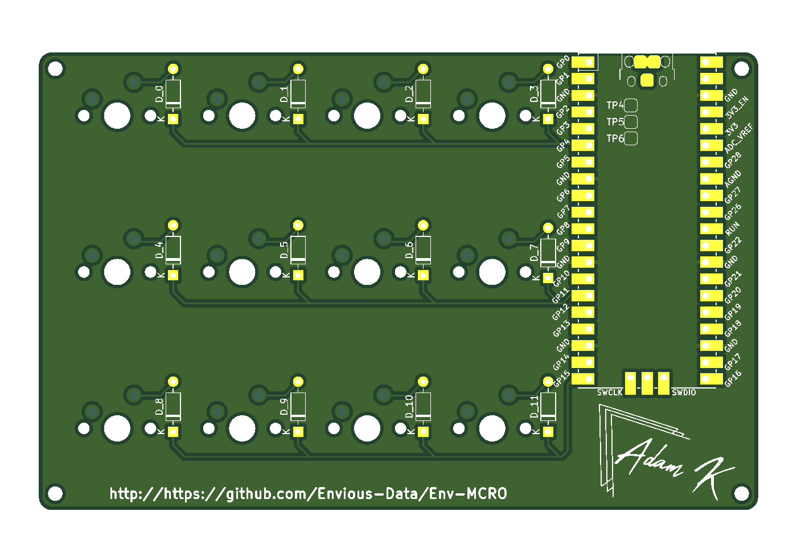

# Env-MCRO
 A Raspberry Pi Pico powered Macro board, like a Streamdeck but cheaper and simpler.

(btw this image is a bit outdated, some of the silkscreen has changed but its physically the same)

### What This?
This is another another mechanical keyboard type thing, this is a small 12 key macro board intended to be used for F13 to F24 but you can do whatever.

Once again This will use KMK and Circuitpython.

I do feel like the rpi pico is a bit overkill for this use, a tiny2040 will probably fit better, Ill have to see if someone has made kidcad bits for that if not Ill probably have to make them my self or whatever.

### Parts List
* 1x Raspberry Pi Pico
* 12x Keyboard Switches
* 12x 1N4148 Diodes (through hole)
* 12x Keycaps
* Macro Board PCB
- (The board dimentions are: 109.6mm x 69.7mm)

### Quick setup guide
* Flash Circuitpython to your Raspberry Pi Pico
* Download [This Firmware zip](https://github.com/Envious-Data/Env-KB/blob/53389ea669cd263dd28ee5c4033baed8fd03f72c/_Firmware/EnvKB-FW.zip)
* Extract the contents to your Raspberry Pi Pico
* Replace 'main.py' with [This Keymap](https://github.com/Envious-Data/Env-MCRO/blob/587756cf2a3b7770376975891cb7b5841d7c57dd/KMKKeymap.py)

- By default the macro board is mapped with keys F13 to F24 but you can go [Here](https://github.com/KMKfw/kmk_firmware/blob/master/docs/keycodes.md) and look at what keys you can re-map with